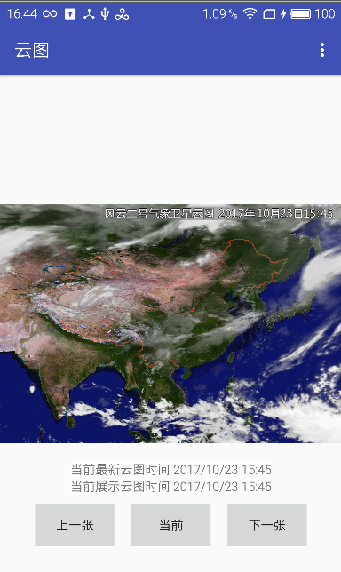

# WeatherCloud 风云二号卫星云图




### 接口方案
> * 国家气象局接口（08:15-23:45） v1.0使用，图片大小133k
> * 新浪天气图片接口 （03:45-23:45）V2.0 使用，图片大小500k
> * 中国天气网


### 新浪天气接口
```
http://sinastorage.com/storage.service.mix.sina.com.cn/satellite_weather_pic/nephogram/nmc_fy2-2017-10-01-17-30.jpg

```
|nmc_fy2-2017-10-01-17-30|2017年10月1日17点45分云图|
|---|---|
|17-30|取值为17-00或者17-30 范围(03:30-23:30)，17-00代表卫星17:15,17-30代表卫星17:45，只有当前北京时间超过17:35,参数才可以填写17:00，否则无效，即：能拿到20分钟之前的图片。


