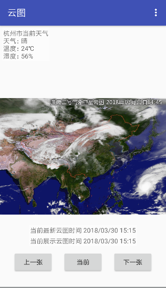

# WeatherCloud 风云二号卫星云图




### 接口方案
> * 中英气象台接口（08:15-23:45） v1.0使用
> * 新浪天气图片接口 （08:15-23:45）V1.2 使用
> * 中国天气网（00:15-23:45）v1.3 使用
> * 国家气象信息中心(中国气象局气象数据中心)(00:15-23:45)

### 中英气象台接口
```
http://image.nmc.cn/product/2017/10/30/WXCL/medium/SEVP_NSMC_WXCL_ASC_E99_ACHN_LNO_PY_20171030021500000.JPG?v=1509330117327

```


### 新浪天气接口
```
http://sinastorage.com/storage.service.mix.sina.com.cn/satellite_weather_pic/nephogram/nmc_fy2-2017-10-01-17-30.jpg

```

|nmc_fy2-2017-10-01-17-30|2017年10月1日17点45分云图|
|---|---|
|17-30|取值为17-00或者17-30 范围(03:30-23:30)，17-00代表卫星17:15,17-30代表卫星17:45，只有当前北京时间超过17:35,参数才可以填写17:00，否则无效，即：能拿到20分钟之前的图片。


### 中国天气网
```
http://pi.weather.com.cn/i/product/pic/m/sevp_nsmc_wxcl_asc_e99_achn_lno_py_20171030024500000.jpg
```

### 国家气象信息中心(中国气象局气象数据中心)
```
http://image.data.cma.cn/vis/P_WXCL_ASC_E99_ACHN_LNO_PY/20171030/SEVP_NSMC_WXCL_ASC_E99_ACHN_LNO_PY_20171030001500000.JPG
```


